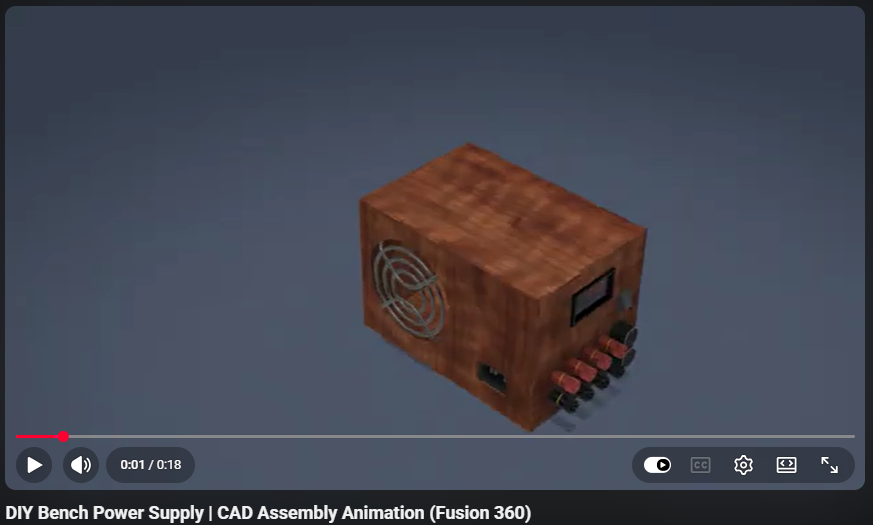
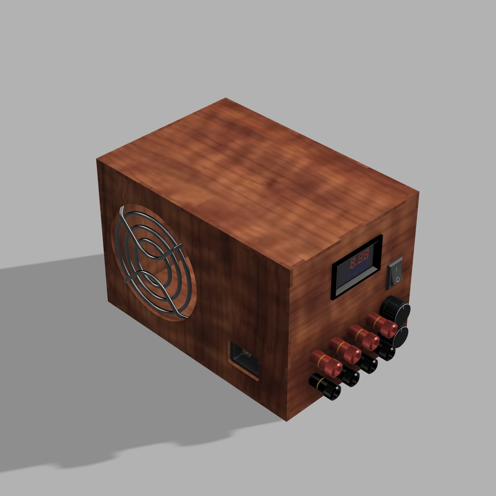
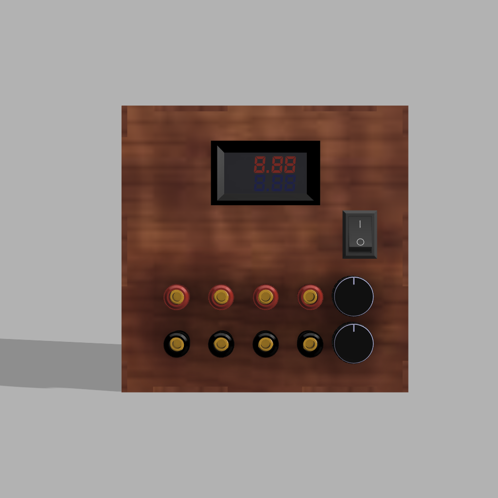

# ⚡ Open-Source Bench Power Supply

An open-source, DIY bench power supply designed for precision voltage and current regulation. Repurposing an old PC ATX power supply, this build leverages the **XL4015 5A DC-DC Step-Down Buck Module** for robust regulation and integrates a **DSN-VC288** dual display for real-time voltage and current monitoring. 

Whether you are powering up custom PCB layouts, tuning DC motor control circuits, or running standalone microcontrollers, this compact unit provides the stable, adjustable power required for reliable testing and development.

---

## 📸 Project Media

### Overview


<p align="center">
  
</p>

<p align="center">
  ▶️ <a href="https://www.youtube.com/watch?v=nhQbDIVF7So"><b>Watch the Assembly & Demonstration on YouTube</b></a>
</p>

---
### 3D Renderings
Here is a look at the mechanical design and assembly.

<p align="center">
  
  
</p>
<p align="center">
  <em>(Fig1: Home view. Fig2: Front -Panel Interface-)</em>
</p>

---

## ✨ Features
* **Upcycled Core:** Gives a second life to a standard desktop PC power supply.
* **Precision Regulation:** Utilizes the XL4015 buck converter for clean, adjustable DC output (up to 5A).
* **Integrated Telemetry:** Front-panel DSN-VC288 meter provides instant, clear feedback on voltage and current draw.
* **Modular CAD Design:** Fully modeled enclosure and components. The geometry is clean and easily modified to fit different hardware footprints.
* **Standard Interfaces:** Uses 10K potentiometers for fine-tuning and standard red/black banana plugs for universal lead compatibility.

---

## 🛠️ CAD & 3D Modeling

The physical enclosure and component mountings were meticulously modeled. Native Autodesk Fusion 360 project files are included, making it easy to edit features, adjust tolerances, or remix the design for your specific PC power supply dimensions.

🔗 **[View and Download the Native Fusion 360 Model Here](https://a360.co/4vcgt6b)**

Standardized `.step` files are also provided for all individual parts and the main assembly for use in other CAD environments.

---

## 📂 Repository Structure

```text
├── CAD/
│   ├── Documentation/
│   │   ├── Pictures
│   │   └── Videos
│   ├── DXF
│   ├── Fusion
│   ├── STEP/
│   │   ├── Assembly
│   │   └── Parts
├── Hardware/
│   ├── BOM
│   ├── Documentation/
│   │   ├── Pictures
│   │   └── Videos
│   ├── PDFs/
│   │   ├── Circuit
│   │   └── DNS_VC288
└── README.md
```

---
## ⚙️ Hardware & Bill of Materials (BOM)
A complete breakdown of the required hardware, wiring diagrams, and datasheets can be found in the `Hardware/` directory.


### Core Components List:
| Component                     | Quantity | Notes                                        |
| ----------------------------- | -------- | -------------------------------------------- |
| PC ATX Power Supply           | 1        | Source of DC power, upcycled from old PC     |
| XL4015 DC-DC Step-Down Module | 1        | For voltage regulation                       |
| DSN-VC288 Dual Display        | 1        | For real-time voltage and current monitoring |
| 10K Potentiometer             | 2        | For adjusting voltage and current limits     |
| Banana Plugs (Red/Black)      | 8        | For output connections                       |
| Enclosure                     | 1        | For housing the components                   |
| Rocker Switch                 | 1        | For power control                            |

For detailed sourcing, refer to the 🔗 **[BOM.xlsx](https://github.com/youssefadell11/DIY-Bench-Power-Supply-EG/tree/main/Hardware/BOM)**

---
## 📝 License & Open Source
This project is open-source. You are free to download, modify, and integrate this design into your own electronic workspaces. Contributions, forks, and improvements to the enclosure or wiring schematics are welcome!